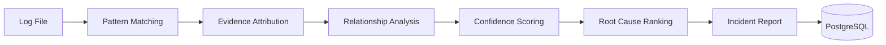

<div align="center">

# 🩺 Deployment Doctor

### Deterministic Root Cause Analysis for Deployment Failures

Analyze deployment logs using a rule-based incident detection engine built for DevOps and SRE workflows.

Same log → Same result → Every time.

<br>


</div>

---

## ✨ Overview

Deployment Doctor is an explainable incident detection platform that analyzes deployment logs and identifies root causes using deterministic rules, evidence attribution, and relationship analysis.

Unlike AI-based log analyzers, every result is:

* 🔍 Explainable
* 📌 Evidence-backed
* ♻️ Reproducible
* 🧾 Auditable

Detection logic never relies on AI.

AI is used only as an optional summary layer.

---

## 🎯 Why This Exists

When deployments fail, engineers usually:

* Read thousands of log lines manually
* Search dashboards for clues
* Ask an LLM to guess the issue

Each approach has tradeoffs.

Deployment Doctor explores a different idea:

> Model operational knowledge as deterministic rules instead of probabilistic predictions.

The result is a system that can explain exactly why it reached a conclusion.

---

## 📊 Project Snapshot

| Metric              | Value      |
| ------------------- | ---------- |
| Engine Version      | 1.6.0      |
| Incident Blueprints | 10         |
| Detection Rules     | 90         |
| Tests               | 41         |
| Coverage            | 90%+       |
| Backend             | FastAPI    |
| Database            | PostgreSQL |
| Frontend            | React      |

---

## 🚀 Example

### Input

```log
ERROR: ECONNREFUSED 10.0.0.5:5432
database connection failed
retrying database connection
CrashLoopBackOff
```

### Result

```json
{
  "primary_incident": "DB_CONNECTION_FAILURE",
  "confidence": 100,
  "status": "CONFIDENT"
}
```

### Why?

```text
Line 42:
ERROR: ECONNREFUSED 10.0.0.5:5432

Pattern:
ECONNREFUSED

Weight:
+40
```

Every score can be traced back to evidence.

---

## 🏗 Architecture



---

## ⚡ Detection Pipeline

```text
Upload Log
    ↓
Validate Input
    ↓
Pattern Matching
    ↓
Evidence Attribution
    ↓
Relationship Analysis
    ↓
Scoring
    ↓
Ranking
    ↓
Store Result
```

---

## ✨ Features

### Detection Engine

* Deterministic incident detection
* Rule-based scoring
* Evidence attribution
* Root cause ranking
* Relationship-aware analysis
* DAG validation

### Platform

* REST API
* PostgreSQL persistence
* React dashboard
* Analysis history
* Sample log scenarios
* Optional AI summaries

---

## 🧠 Engineering Highlights

### Deterministic by Design

Same input produces the same output.

No prompts.
No randomness.
No model drift.

---

### Explainability First

Every finding references:

* Evidence line
* Matched pattern
* Score contribution

---

### Relationship-Aware Detection

Blueprints form a Directed Acyclic Graph.

```text
DNS_FAILURE
      ↓
DB_CONNECTION_FAILURE
      ↓
CRASH_LOOP_BACKOFF
```

The engine understands causal chains rather than isolated errors.

---

### JSONB Report Storage

Complete analysis reports are stored as JSONB documents while key fields remain indexed for filtering and analytics.

---

## 🛠 Tech Stack

### Backend

* Python
* FastAPI
* SQLAlchemy Async
* PostgreSQL
* Pydantic v2

### Frontend

* React
* TailwindCSS

### Infrastructure

* Docker
* Docker Compose
* GitHub Actions

---

## 📡 API

| Method | Endpoint            |
| ------ | ------------------- |
| POST   | `/api/analyze`      |
| POST   | `/api/analyze/json` |
| GET    | `/api/results/{id}` |
| GET    | `/api/results`      |
| GET    | `/api/incidents`    |
| GET    | `/api/samples`      |
| GET    | `/api/health`       |

---

## 📁 Repository Structure

```text
deployment-doctor/

├── backend/
│   ├── app/
│   ├── rules/
│   ├── sample-logs/
│   └── tests/
│
├── frontend/
│   └── src/
│
├── docs/
│   ├── architecture.md
│   ├── detection-pipeline.md
│   ├── scoring.md
│   ├── relationships-dag.md
│   └── api-reference.md
│
└── README.md
```

---

## 🚀 Quick Start

```bash
git clone <repo>

cd backend

python -m venv venv

source venv/bin/activate

pip install -r requirements.txt

uvicorn server:app --reload
```

Run tests:

```bash
pytest tests/ -v
```

---

## 📸 Screenshots

### Analysis Dashboard


### Incident Report


### Knowledge Base


---

## 🗺 Roadmap

* Analysis history
* Markdown exports
* Prometheus metrics
* Blueprint editor
* Aho-Corasick matching
* Async analysis queue
* Blueprint versioning
* Kubernetes log streaming

---


<div align="center">

Built around three principles

**Explainability · Determinism · Operational Trust**

</div>
