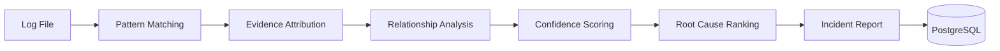

# 🩺 Deployment Doctor

### Deterministic Root Cause Analysis for Deployment Failures

Analyze Kubernetes and application deployment logs using a rule-based incident detection engine built for DevOps and SRE workflows.

No AI-driven detection.
No black-box confidence scores.
No hallucinated root causes.

Every conclusion is explainable, reproducible, and backed by evidence.

<p align="center">


</p>

---

## ✨ Why This Project Exists

When a deployment fails, engineers usually end up doing one of three things:

* Reading thousands of log lines manually
* Searching dashboards and monitoring tools for clues
* Asking an LLM to guess what happened

Each approach has limitations.

Manual analysis is slow.

Dashboards require instrumentation.

LLMs are non-deterministic and difficult to audit.

Deployment Doctor explores a different approach:

> Model operational knowledge as deterministic rules, relationships, and evidence instead of probabilistic predictions.

The result is a system that produces the same answer for the same log file every time.

---

## 🎯 What Makes It Different

| Traditional AI Log Analysis     | Deployment Doctor        |
| ------------------------------- | ------------------------ |
| Different answers for same logs | Same input → Same output |
| Difficult to audit              | Fully traceable          |
| Hallucinated fixes possible     | Rules only               |
| Black-box confidence            | Transparent scoring      |
| Expensive token usage           | Runs locally             |
| Requires external APIs          | Works offline            |

---

## 🚀 Example Analysis

### Input

```log
ERROR: ECONNREFUSED 10.0.0.5:5432
database connection failed
retrying database connection
CrashLoopBackOff
```

### Output

```json
{
  "primary_incident": "DB_CONNECTION_FAILURE",
  "confidence": 100,
  "detection_status": "CONFIDENT"
}
```

### Evidence

```text
Line 42
ERROR: ECONNREFUSED 10.0.0.5:5432

Matched Pattern:
ECONNREFUSED

Score Contribution:
+40
```

Every score can be traced back to specific evidence records.

---

## 🏗 Architecture



---

## ⚙️ Detection Pipeline

```text
Upload Log
    ↓
Validate Input
    ↓
Pattern Matching
    ↓
Evidence Collection
    ↓
Relationship Analysis
    ↓
Confidence Scoring
    ↓
Root Cause Ranking
    ↓
Store Result
```

---

## ✨ Features

### Detection Engine

* Deterministic incident detection
* Rule-based pattern matching
* Evidence attribution with line numbers
* Confidence scoring system
* Root-cause ranking engine
* Relationship-aware incident analysis
* DAG validation at startup

### API

* Multipart file uploads
* JSON-based analysis endpoint
* Incident blueprint API
* Historical analysis retrieval
* Sample log scenarios
* Health monitoring endpoints

### Persistence

* PostgreSQL storage
* JSONB result documents
* Analysis history
* Structured metadata indexing

### User Experience

* React dashboard
* Evidence viewer
* Incident relationship graph
* Confidence visualization
* Optional AI-generated summaries

---

## 📊 Current Scale

| Metric              | Value           |
| ------------------- | --------------- |
| Incident Blueprints | 10              |
| Detection Rules     | 90              |
| Tests               | 41              |
| Coverage            | 90%+            |
| Backend             | FastAPI         |
| Database            | PostgreSQL      |
| Frontend            | React           |
| Detection Logic     | 100% Rule-Based |

---

## 🧠 Interesting Engineering Decisions

### Deterministic Instead of AI-Driven

The engine uses weighted rules rather than probabilistic predictions.

Benefits:

* Reproducible results
* Easier testing
* Explainable decisions
* Operational trust

---

### Incident Relationships Form a DAG

Blueprints define causal relationships.

```text
DNS_FAILURE
      ↓
DB_CONNECTION_FAILURE
      ↓
CRASH_LOOP_BACKOFF
```

Startup validation prevents circular dependencies.

---

### JSONB Result Storage

Analysis reports are stored as complete JSON documents.

Benefits:

* Schema flexibility
* Atomic retrieval
* Simplified report generation
* Easier evolution of result structures

---

## 🛠 Tech Stack

### Backend

* Python 3.11
* FastAPI
* SQLAlchemy Async
* PostgreSQL
* Pydantic v2

### Frontend

* React
* TailwindCSS

### Infrastructure

* Docker
* Docker Compose
* GitHub Actions

---

## 📡 API Overview

| Method | Endpoint            | Description              |
| ------ | ------------------- | ------------------------ |
| POST   | `/api/analyze`      | Analyze uploaded logs    |
| POST   | `/api/analyze/json` | Analyze raw JSON logs    |
| GET    | `/api/results/{id}` | Retrieve stored report   |
| GET    | `/api/results`      | List recent analyses     |
| GET    | `/api/incidents`    | List incident blueprints |
| GET    | `/api/samples`      | Demo scenarios           |
| GET    | `/api/health`       | Health information       |

Full API documentation:

```text
docs/api-reference.md
```

---

## 📁 Repository Structure

```text
deployment-doctor/

├── backend/
│   ├── app/
│   ├── rules/
│   ├── sample-logs/
│   └── tests/
│
├── frontend/
│   └── src/
│
├── docs/
│   ├── architecture.md
│   ├── detection-pipeline.md
│   ├── scoring.md
│   ├── relationships-dag.md
│   └── api-reference.md
│
└── README.md
```

---

## 🚀 Quick Start

### Backend

```bash
cd backend

python -m venv venv

source venv/bin/activate

pip install -r requirements.txt

uvicorn server:app --reload
```

### Frontend

```bash
cd frontend

yarn install

yarn start
```

### Run Tests

```bash
cd backend

pytest tests/ -v
```

---

## 📸 Screenshots

### Upload & Analysis

> Add screenshot here

```text
docs/images/upload-page.png
```

### Incident Report

> Add screenshot here

```text
docs/images/report-page.png
```

### Knowledge Base

> Add screenshot here

```text
docs/images/knowledge-base.png
```

---

## ⚠️ Current Limitations

* Substring matching scales linearly with rule count
* Analysis runs in-process on the request path
* Duplicate log submissions are not yet deduplicated
* Rule maintenance is manual

---

## 🗺 Roadmap

### Near-Term

* Analysis history page
* Markdown report export
* Prometheus metrics
* Blueprint editor UI

### Future

* Aho-Corasick pattern matching
* Async analysis queue
* Blueprint versioning
* Kubernetes log streaming
* Team knowledge sharing

---

## 🎓 What This Project Demonstrates

* Backend system design
* Rule engine architecture
* FastAPI development
* PostgreSQL JSONB usage
* Deterministic scoring systems
* Graph algorithms (DAG validation)
* Evidence-based decision systems
* Dockerized development workflows
* CI/CD pipelines
* Production-oriented engineering tradeoffs

---

## 📄 License

MIT License

See `LICENSE` for details.

---

<p align="center">

Built around three principles:

<b>Explainability</b> • <b>Determinism</b> • <b>Operational Trust</b>

</p>
