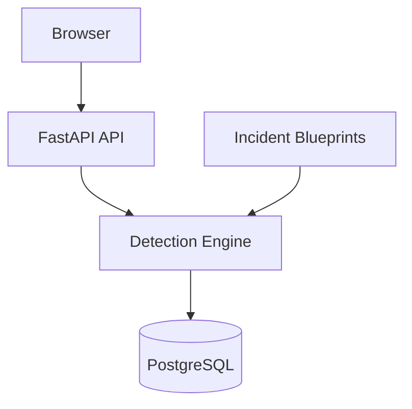

# 🩺 Deployment Doctor

> **Explainable Incident Detection Engine for DevOps & SRE Teams**
>
> Deterministic root-cause analysis for deployment failures using evidence-backed rules, relationship modeling, and auditable scoring.

<p align="center">


</p>

---

## 🚀 Why This Project?

When production deployments fail, engineers need fast answers:

* What failed?
* Why did it fail?
* What evidence supports that conclusion?
* What should be checked next?

Most solutions fall into one of two extremes:

| Approach            | Limitation                               |
| ------------------- | ---------------------------------------- |
| Manual log analysis | Slow and error-prone under pressure      |
| LLM-based analysis  | Non-deterministic and difficult to audit |

Deployment Doctor explores a third approach:

✅ Deterministic detection
✅ Evidence-backed conclusions
✅ Relationship-aware root cause ranking
✅ Full audit trail of every scoring decision
✅ Zero AI dependency for detection

### Core Principle

```text
Same log input
      ↓
Same incident report
      ↓
Every time
```

---

## ✨ Engineering Highlights

* Deterministic rule-based detection engine
* 90 detection rules across 10 incident blueprints
* Evidence attribution with line-level traceability
* DAG-based incident relationship modeling
* Startup-time cycle validation
* Composite scoring engine with bonuses and penalties
* PostgreSQL JSONB report persistence
* Async FastAPI backend
* Optional AI summary layer isolated from detection logic
* 90%+ test coverage with pytest

---

## 🛠 Tech Stack

### Backend

* Python 3.11+
* FastAPI
* SQLAlchemy Async
* PostgreSQL
* Pydantic v2

### Frontend

* React
* TailwindCSS

### Testing

* Pytest
* Coverage.py

### Infrastructure

* Docker
* Docker Compose
* GitHub Actions

### Optional Integrations

* OpenRouter (AI summaries only)

---

## 📋 Table of Contents

1. Project Overview
2. Problem Statement
3. Architecture
4. Implemented Features
5. How It Works
6. API Endpoints
7. Project Structure
8. Setup & Installation
9. Design Decisions
10. Known Limitations
11. Future Improvements
12. Screenshots
13. Documentation

---

# 1. Project Overview

Deployment Doctor is a production-oriented incident detection platform that analyzes deployment logs and generates structured root-cause reports.

Unlike AI-based log analysis systems, the detection engine is entirely deterministic and explainable.

Every conclusion is:

* Traceable to specific log evidence
* Reproducible
* Auditable
* Consistent across executions

| Property            | Value      |
| ------------------- | ---------- |
| Engine Version      | 1.6.0      |
| Incident Blueprints | 10         |
| Detection Rules     | 90         |
| Test Coverage       | 90%+       |
| Detection Method    | Rule-Based |
| AI Required         | No         |
| Database            | PostgreSQL |
| API Framework       | FastAPI    |

---

# 2. Problem Statement

Production incidents are expensive.

When deployments fail, engineers often spend valuable time searching through thousands of log lines trying to identify the actual root cause.

The challenge is rarely finding errors.

The challenge is identifying:

* Which error matters
* Which error is a symptom
* Which incident caused another incident
* Which evidence supports the conclusion

Deployment Doctor addresses this through deterministic detection, scoring, relationship analysis, and evidence attribution.

---

# 3. Architecture



Detailed documentation:

* docs/architecture.md
* docs/detection-pipeline.md

---

# 4. Implemented Features

### Detection Engine

* Deterministic rule matching
* Weighted incident scoring
* Evidence attribution
* Confidence calculation
* Root cause ranking

### Relationship Analysis

* Directed Acyclic Graph (DAG)
* Startup-time cycle detection
* Proximity-aware relationship bonuses

### Persistence

* PostgreSQL storage
* JSONB result snapshots
* Analysis history support

### User Experience

* Upload-based analysis
* Demo scenario library
* Knowledge base viewer
* Optional AI-generated summaries

---

# 5. How It Works

1. Load and validate incident blueprints
2. Receive deployment logs
3. Match patterns against incident rules
4. Collect evidence records
5. Apply scoring logic
6. Evaluate incident relationships
7. Rank incidents deterministically
8. Generate structured report
9. Store results in PostgreSQL
10. Optionally generate AI summary

---

# 6. API Endpoints

| Method | Endpoint              | Description              |
| ------ | --------------------- | ------------------------ |
| POST   | `/api/analyze`        | Analyze multipart upload |
| POST   | `/api/analyze/json`   | Analyze JSON payload     |
| GET    | `/api/results/{id}`   | Fetch analysis           |
| GET    | `/api/results`        | List analyses            |
| GET    | `/api/incidents`      | List blueprints          |
| GET    | `/api/incidents/{id}` | Get blueprint            |
| GET    | `/api/samples`        | Demo scenarios           |
| GET    | `/api/health`         | Health check             |

Full API documentation:

`docs/api-reference.md`

---

# 7. Project Structure

```text
backend/
frontend/
docs/

backend/
├── app/
├── rules/
├── sample-logs/
├── tests/
└── server.py

frontend/
└── src/

docs/
├── architecture.md
├── detection-pipeline.md
├── scoring.md
├── relationships-dag.md
└── api-reference.md
```

---

# 8. Setup & Installation

See installation commands and environment configuration below.

(Keep your current installation section here.)

---

# 9. Design Decisions

### Why Rule-Based Instead of AI?

* Deterministic
* Explainable
* Auditable
* Testable

### Why PostgreSQL?

* Strong schema support
* JSONB flexibility
* Production-ready ecosystem

### Why DAG Relationships?

Allows modeling:

```text
DNS Failure
      ↓
Database Failure
      ↓
CrashLoopBackOff
```

instead of treating all incidents equally.

---

# 10. Known Limitations

* Substring matching instead of indexed matching
* Full upload loaded into memory
* Limited incident blueprint catalog
* Single-node deployment architecture

---

# 11. Future Improvements

### Near Term

* Aho-Corasick pattern index
* Log deduplication
* Analysis history dashboard

### Mid Term

* Prometheus metrics
* Blueprint versioning
* Async analysis queue

### Long Term

* Kubernetes log streaming
* Team-managed blueprint libraries
* Multi-log correlation

---

# 12. Screenshots

### Upload Interface


### Incident Report


### Knowledge Base


---

# 13. Documentation

| Document                   | Description         |
| -------------------------- | ------------------- |
| docs/architecture.md       | System architecture |
| docs/detection-pipeline.md | Analysis workflow   |
| docs/scoring.md            | Scoring model       |
| docs/relationships-dag.md  | Relationship engine |
| docs/api-reference.md      | Full API docs       |

---

## 📈 Project Metrics

| Metric          | Value      |
| --------------- | ---------- |
| Detection Rules | 90         |
| Blueprints      | 10         |
| Test Coverage   | 90%+       |
| API Framework   | FastAPI    |
| Database        | PostgreSQL |
| Frontend        | React      |

---

## 📄 License

MIT License.
