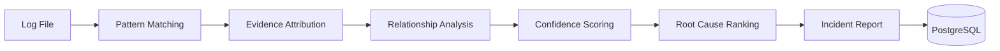
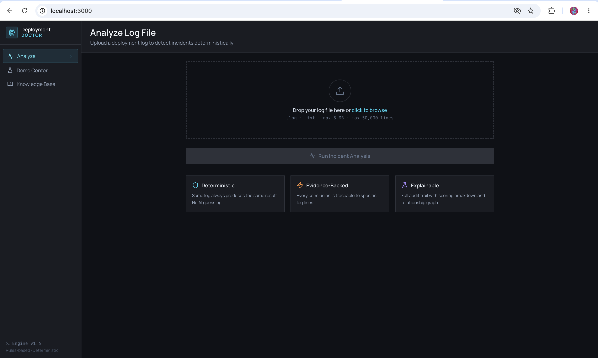
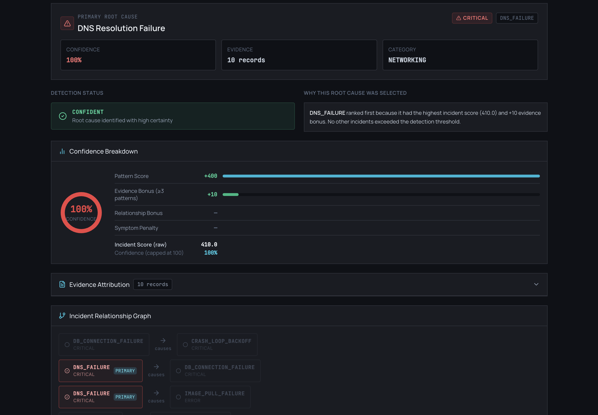
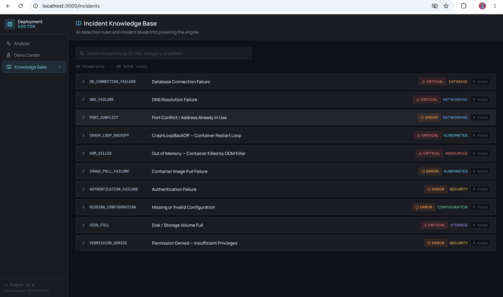

<div align="center">


**Deterministic Root Cause Analysis for Kubernetes and Cloud-Native Failures**

An open-source, production-grade incident detection engine that automates triage and root cause identification for deployment failures. Zero hallucinations. Full explainability. Complete auditability.

---

## Key Metrics

| Metric | Value |
|--------|-------|
| **Incident Blueprints** | 38 |
| **Detection Rules** | 445 |
| **Relationship Edges** | 53 |
| **Incident Scenarios** | 50 |
| **Automated Tests** | 83 |
| **Test Coverage** | 90%+ |
| **Incident Categories** | 11 |

---

## Why Deployment Doctor Exists

When production deployments fail, SREs face an impossible question under pressure:

**"What actually caused this?"**

The industry's standard approaches all fail:

| Approach | Problem |
|----------|---------|
| **Manual log reading** | Too slow, requires deep expertise, error-prone under pressure |
| **Shell scripts / grep** | Single-pattern, no scoring, no relationship awareness |
| **Commercial APM tools** | Require deep instrumentation, useless post-mortem |
| **LLM-based log analysis** | Non-deterministic, hallucinate fixes, impossible to audit for compliance |

Deployment Doctor solves this by implementing **deterministic incident diagnosis**—a fundamentally different approach:

### The Deterministic Difference

```
Same log file → Same result. Every time. No exceptions.
```

Every conclusion is:
- **Traceable** — backed by specific log lines with line numbers
- **Explainable** — linked to named patterns with assigned weights
- **Reproducible** — no runtime randomness, no AI influence
- **Auditable** — complete decision trail for compliance and debugging

### Core Value Proposition

```
Deployment Doctor separates root causes from downstream symptoms,
understands that one failure cascades into many,
and produces a ranked diagnosis backed by evidence.

All without magic. All automatically. All deterministically.
```

---

## How It Works

### Detection Pipeline

```
Logs
  ↓
Pattern Matching (445 rules × every log line)
  ↓
Evidence Attribution (deduplicated, line-level proof)
  ↓
Confidence Scoring (transparent, weighted formula)
  ↓
Relationship Analysis (DAG validation, causality checks)
  ↓
Root Cause Ranking (penalties for symptoms, bonuses for chains)
  ↓
Incident Report (ranked findings + audit trail)
```

Each stage produces complete intermediate outputs. Every decision is traceable. Nothing is hidden.

---

## Key Features

### 1. Deterministic Pattern Matching
- 445 detection rules applied consistently to every log line
- Zero non-determinism, zero randomness
- Identical analysis for identical inputs, guaranteed

### 2. Evidence Attribution Engine
- Every detected incident is backed by specific log lines
- Line numbers and exact matches logged
- Complete traceability for incident investigation

### 3. Confidence Scoring
- Transparent, rule-based formula (no black boxes)
- Component breakdown: pattern matches, relationship bonuses, role penalties
- Explainable score justification for every incident

### 4. Relationship Analysis Engine
- DAG-based incident reasoning
- Automatically identifies cascading failures
- Distinguishes root causes from downstream symptoms
- Validates cause-effect chains against log proximity

### 5. Root Cause Ranking
- Penalizes symptom-role incidents (prevents false positives)
- Bonuses for validated relationship chains
- Deterministic tie-breaking
- Clear ranking with confidence intervals

### 6. Complete Audit Trail
- Full decision log for every incident
- Traceable scoring components
- Compliance-ready logs for audit purposes

---

## The Operational Knowledge Engine

Deployment Doctor's core asset is its **Operational Knowledge Engine**—a curated library of incident patterns, rules, and relationships built from real-world Kubernetes and cloud-native failure modes.

### Blueprint System

**38 Incident Blueprints** cover common failure categories:

- **Database Failures** (connection, pool exhaustion, unavailability)
- **Networking Issues** (DNS resolution, firewall policies, latency)
- **Container Failures** (CrashLoopBackOff, ImagePullBackOff, OOMKilled)
- **Resource Constraints** (CPU throttling, memory pressure, disk space)
- **Configuration Errors** (invalid secrets, bad config maps, version mismatches)
- **Orchestration Issues** (pod eviction, node pressure, scheduling failures)
- **And 5 more categories...**

### Rule System

**445 Detection Rules** translate business incident patterns into searchable log patterns:

Each rule specifies:
- Pattern text to match
- Weight (importance)
- Severity level
- Category classification
- Verification steps
- Recommended fixes

### Relationship Modeling

**53 Relationship Edges** connect incidents in a directed acyclic graph:

- DNS failure → causes → application connection failures
- Resource exhaustion → causes → CrashLoopBackOff
- Configuration error → causes → health check failures
- **Complete causality chain for incident triage**

### Evidence Attribution

Every match includes:
- Blueprint ID and name
- Pattern that matched
- Log line number and content
- Confidence contribution
- Role classification (root cause vs symptom)

---

## Relationship Analysis: Understanding Cascades

Deployment Doctor understands that **one failure cascades into many**.

When DNS resolution fails, applications can't connect to databases. When databases become unavailable, applications crash. When applications crash, Kubernetes restarts them repeatedly (CrashLoopBackOff). A single root cause produces a waterfall of symptoms.

### Multi-Hop Cascade Discovery

The engine automatically identifies these chains:

```
DNS_FAILURE
  ├─ causes ─> DB_CONNECTION_FAILURE
  │               ├─ causes ─> CRASH_LOOP_BACKOFF
  │               └─ causes ─> APPLICATION_TIMEOUT
  └─ causes ─> SERVICE_UNAVAILABLE
```

# 🩺 Deployment Doctor

### Deterministic Root Cause Analysis for Deployment Failures

Analyze deployment logs using a rule-based incident detection engine built for DevOps and SRE workflows.

Same log → Same result → Every time.

<br>


</div>

---

## ✨ Overview

Deployment Doctor is an explainable incident detection platform that analyzes deployment logs and identifies root causes using deterministic rules, evidence attribution, and relationship analysis.

Unlike AI-based log analyzers, every result is:

* 🔍 Explainable
* 📌 Evidence-backed
* ♻️ Reproducible
* 🧾 Auditable

Detection logic never relies on AI.

AI is used only as an optional summary layer.

---

## 🎯 Why This Exists

When deployments fail, engineers usually:

* Read thousands of log lines manually
* Search dashboards for clues
* Ask an LLM to guess the issue

Each approach has tradeoffs.

Deployment Doctor explores a different idea:

> Model operational knowledge as deterministic rules instead of probabilistic predictions.

The result is a system that can explain exactly why it reached a conclusion.

---

## 📊 Project Snapshot

| Metric              | Value      |
| ------------------- | ---------- |
| Engine Version      | 1.6.0      |
| Incident Blueprints | 10         |
| Detection Rules     | 90         |
| Tests               | 41         |
| Coverage            | 90%+       |
| Backend             | FastAPI    |
| Database            | PostgreSQL |
| Frontend            | React      |

---

## 🚀 Example

### Input

```log
ERROR: ECONNREFUSED 10.0.0.5:5432
database connection failed
retrying database connection
CrashLoopBackOff
```

### Result

```json
{
  "primary_incident": "DB_CONNECTION_FAILURE",
  "confidence": 100,
  "status": "CONFIDENT"
}
```

### Why?

```text
Line 42:
ERROR: ECONNREFUSED 10.0.0.5:5432

Pattern:
ECONNREFUSED

Weight:
+40
```

Every score can be traced back to evidence.

---

## 🏗 Architecture



---

## ⚡ Detection Pipeline

```text
Upload Log
    ↓
Validate Input
    ↓
Pattern Matching
    ↓
Evidence Attribution
    ↓
Relationship Analysis
    ↓
Scoring
    ↓
Ranking
    ↓
Store Result
```

---

## ✨ Features

### Detection Engine

* Deterministic incident detection
* Rule-based scoring
* Evidence attribution
* Root cause ranking
* Relationship-aware analysis
* DAG validation

### Platform

* REST API
* PostgreSQL persistence
* React dashboard
* Analysis history
* Sample log scenarios
* Optional AI summaries

---

## 🧠 Engineering Highlights

### Deterministic by Design

Same input produces the same output.

No prompts.
No randomness.
No model drift.

---

### Explainability First

Every finding references:

* Evidence line
* Matched pattern
* Score contribution


### Root Cause vs. Symptom Discrimination


Incidents are classified as either:

- **Root Cause**: The underlying failure (DNS down, config invalid, storage full)
- **Symptom**: The downstream effect (CrashLoopBackOff, pod eviction, connection timeout)

Ranking algorithm penalizes symptoms so that true root causes float to the top.

---

## Architecture Overview

### System Layers

```
┌─────────────────────────────────────┐
│      Frontend (React)               │
│  - Interactive incident dashboard   │
│  - Cascade explorer                 │
│  - Relationship graph viewer        │
└──────────────┬──────────────────────┘
               │ REST API
┌──────────────▼──────────────────────┐
│   Detection Engine (Python/FastAPI) │
│  - Pattern Matching                 │
│  - Evidence Attribution             │
│  - Confidence Scoring               │
│  - Relationship Analysis            │
│  - Root Cause Ranking               │
└──────────────┬──────────────────────┘
               │
┌──────────────▼──────────────────────┐
│   Knowledge Base (incidents.json)   │
│  - 38 blueprints                    │
│  - 445 detection rules              │
│  - 53 relationship edges            │
│  - 11 incident categories           │
└─────────────────────────────────────┘
```

### Technology Stack

| Component | Technology |
|-----------|-----------|
| **Backend** | Python, FastAPI, PostgreSQL |
| **Frontend** | React, Tailwind CSS |
| **Deployment** | Docker, Docker Compose, Kubernetes |
| **Testing** | pytest (backend), Jest (frontend) |
| **Rules Engine** | Custom deterministic pattern matcher |

---

## Screenshots

### Landing Dashboard
*Interactive incident overview with severity indicators and cascade visualization*

### Relationship-Aware Detection

Blueprints form a Directed Acyclic Graph.

```text
DNS_FAILURE
      ↓
DB_CONNECTION_FAILURE
      ↓
CRASH_LOOP_BACKOFF
```

The engine understands causal chains rather than isolated errors.

---

### JSONB Report Storage

Complete analysis reports are stored as JSONB documents while key fields remain indexed for filtering and analytics.

---

## 🛠 Tech Stack

### Backend

* Python
* FastAPI
* SQLAlchemy Async
* PostgreSQL
* Pydantic v2

### Frontend

* React
* TailwindCSS

### Infrastructure

* Docker
* Docker Compose
* GitHub Actions

---

## 📡 API

| Method | Endpoint            |
| ------ | ------------------- |
| POST   | `/api/analyze`      |
| POST   | `/api/analyze/json` |
| GET    | `/api/results/{id}` |
| GET    | `/api/results`      |
| GET    | `/api/incidents`    |
| GET    | `/api/samples`      |
| GET    | `/api/health`       |


[Dashboard View Placeholder]


### Incident Analysis
*Detailed breakdown of detected incidents with evidence attribution and scoring components*

[Incident Details Placeholder]

### Operational Knowledge Library
*Browsable catalog of 38 incident blueprints with rules, verification steps, and recommended fixes*

[Knowledge Library Placeholder]

### Cascade Explorer
*Visual representation of incident relationships and failure cascades*

[Cascade Graph Placeholder]

### Relationship Graph
*Interactive DAG visualization of incident dependencies*

[Relationship Graph Placeholder]

---

## Quick Start

### 1. Clone the Repository

```bash
git clone https://github.com/yourusername/deployment-doctor.git
cd deployment-doctor
```

### 2. Local Development Setup

```bash
# Backend setup
cd backend
python3 -m venv venv
source venv/bin/activate
pip install -r requirements.txt

# Run backend
python server.py
```

```bash
# Frontend setup (in new terminal)
cd frontend
npm install
npm start
```

Backend API: `http://localhost:8000`  
Frontend: `http://localhost:3000`

### 3. Try an Analysis

Upload a Kubernetes deployment log via the web interface, or use the API:

```bash
curl -X POST http://localhost:8000/api/analyze \
  -H "Content-Type: application/json" \
  -d '{"log_content": "your log content here"}'
```

---

## Docker Setup

### Docker Compose (Recommended)

```bash
# Start all services
docker-compose up

# Access services
# Frontend: http://localhost:3000
# Backend API: http://localhost:8000
# API Health: http://localhost:8000/api/health
```

### Individual Containers

```bash
# Build images
docker build -t deployment-doctor-backend ./backend
docker build -t deployment-doctor-frontend ./frontend

# Run containers
docker run -p 8000:8000 deployment-doctor-backend
docker run -p 3000:3000 deployment-doctor-frontend
```

---

## API Overview

### Health Check

```bash
GET /api/health
```

Returns engine status, blueprints loaded, rules loaded.

### Analyze Logs

```bash
POST /api/analyze
Content-Type: application/json

{
  "log_content": "string: raw log text"
}
```

Returns detected incidents, confidence scores, evidence, relationships, and full audit trail.

### Sample Scenarios

```bash
GET /api/samples
```

Returns 50 pre-configured incident scenarios for testing.

### Incident Knowledge Base

```bash
GET /api/incidents
```

Returns all 38 blueprints with rules, relationships, verification steps, and fixes.

---

## Testing

### Run Backend Tests

```bash
cd backend
pytest tests/ -v
```

**Coverage**: 90%+  
**Test Count**: 83 automated tests

### Run Frontend Tests

```bash
cd frontend
npm test
```

---

## Project Structure

```
deployment-doctor/
├── backend/                    # Python FastAPI backend
│   ├── app/
│   │   ├── api/               # API endpoints
│   │   ├── services/          # Core engines
│   │   │   ├── root_cause_engine.py
│   │   │   ├── pattern_matcher.py
│   │   │   ├── relationship_engine.py
│   │   │   ├── scoring_engine.py
│   │   │   └── blueprint_validator.py
│   │   ├── models.py          # Data structures
│   │   ├── schemas.py         # API schemas
│   │   └── database.py        # DB models
│   ├── rules/
│   │   └── incidents.json     # Knowledge base
│   └── tests/                 # Unit tests
├── frontend/                   # React frontend
│   ├── src/
│   │   ├── components/        # UI components
│   │   ├── pages/             # Page views
│   │   └── hooks/             # Custom hooks
│   └── public/
├── docs/                       # Documentation
│   ├── ARCHITECTURE.md
│   ├── KNOWLEDGE_ENGINE.md
│   ├── RELATIONSHIP_ANALYSIS.md
│   ├── ACQUISITION_OVERVIEW.md
│   └── PROJECT_METRICS.md
├── docker-compose.yml         # Multi-container setup
└── README.md                  # This file
```

---

## Documentation

Comprehensive documentation is provided:

- **[ARCHITECTURE.md](docs/ARCHITECTURE.md)** — Detailed technical breakdown of the detection pipeline, scoring model, and relationship analysis engine
- **[KNOWLEDGE_ENGINE.md](docs/KNOWLEDGE_ENGINE.md)** — Complete reference for the 38 incident blueprints, 445 rules, and 53 relationships
- **[RELATIONSHIP_ANALYSIS.md](docs/RELATIONSHIP_ANALYSIS.md)** — Deep dive into DAG modeling, cascade detection, and root cause identification
- **[ACQUISITION_OVERVIEW.md](docs/ACQUISITION_OVERVIEW.md)** — Product summary for technical evaluators and buyers
- **[PROJECT_METRICS.md](docs/PROJECT_METRICS.md)** — Automated metrics and statistics on the knowledge base

---

## Roadmap

### Current (v1.6.0)

- ✅ Deterministic pattern matching engine
- ✅ Evidence attribution system
- ✅ Confidence scoring with transparent formula
- ✅ DAG-based relationship analysis
- ✅ Root cause ranking algorithm
- ✅ Complete audit trail logging
- ✅ Interactive dashboard
- ✅ API-first architecture

### Future

- **v1.7.0**: Custom rule builder UI
- **v1.8.0**: Kubernetes operator for cluster-native integration
- **v1.9.0**: Multi-tenant deployment
- **v2.0.0**: Machine learning enhancement (optional, opt-in)

---

## Contributing

Contributions are welcome! Areas for contribution:

- **New incident blueprints** (add to `backend/rules/incidents.json`)
- **Detection rules** (additional patterns for existing blueprints)
- **Test scenarios** (improve coverage)
- **Documentation** (clarify existing docs or add new guides)
- **Frontend features** (new visualizations, dashboards)

Please open an issue to discuss major changes before submitting a pull request.

---

## License

This project is licensed under the MIT License. See LICENSE file for details.

---

## Support

- 📖 **Documentation**: See [docs/](docs/) directory
- 🐛 **Issues**: GitHub Issues
- 💬 **Discussions**: GitHub Discussions
- 📧 **Contact**: [Contact information]

---

## Acknowledgments

Built for SREs, DevOps engineers, and platform teams managing cloud-native infrastructure. 

Deployment Doctor exists because production incidents deserve transparent, deterministic analysis—not guesses wrapped in confidence scores.

---

**Last Updated**: June 2026  
**Current Version**: 1.6.0  
**Incident Blueprints**: 38  
**Detection Rules**: 445

## 📁 Repository Structure

```text
deployment-doctor/

├── backend/
│   ├── app/
│   ├── rules/
│   ├── sample-logs/
│   └── tests/
│
├── frontend/
│   └── src/
│
├── docs/
│   ├── architecture.md
│   ├── detection-pipeline.md
│   ├── scoring.md
│   ├── relationships-dag.md
│   └── api-reference.md
│
└── README.md
```

---

## 🚀 Quick Start

```bash
git clone https://github.com/Guna-Asher/Deployment_Doctor.git

cd backend

python -m venv venv

source venv/bin/activate

pip install -r requirements.txt

uvicorn server:app --reload
```

Run tests:

```bash
pytest tests/ -v
```

---

## 📸 Screenshots

### Analysis Dashboard



### Incident Report



### Knowledge Base



---

## 🗺 Roadmap

* Analysis history
* Markdown exports
* Prometheus metrics
* Blueprint editor
* Aho-Corasick matching
* Async analysis queue
* Blueprint versioning
* Kubernetes log streaming

---


<div align="center">

Built around three principles

**Explainability · Determinism · Operational Trust**

</div>

